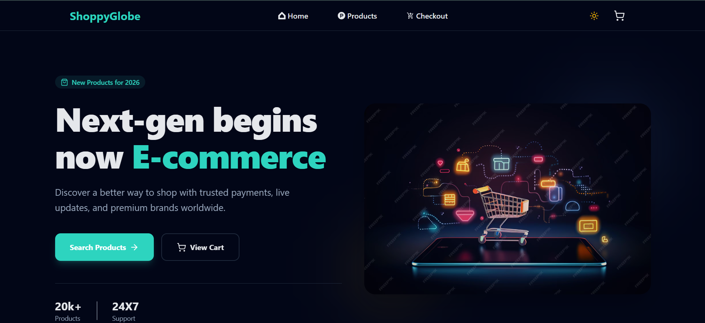

# 🛍️ ShoppyGlobe — Modern E-commerce Experience

ShoppyGlobe is a high-performance, fully responsive e-commerce web application built using **React, Redux Toolkit, and Tailwind CSS**. It delivers a seamless shopping experience with modern UI, optimized performance, and scalable architecture.

---

## 🚀 Key Features

* 🔍 **Smart Product Discovery**
  Explore products with real-time search and dynamic filtering.

* 📄 **Detailed Product Views**
  View complete product information including images, ratings, and descriptions.

* 🛒 **Interactive Shopping Cart**
  Add, remove, and manage product quantities effortlessly.

* 💳 **Smooth Checkout Flow**
  Clean and intuitive checkout experience with order summary.

* 📱 **Responsive Design**
  Optimized for mobile, tablet, and desktop devices.

* 🌙 **Dark / Light Mode**
  Toggle themes for a personalized user experience.

* ⚡ **Performance Optimized**
  Uses lazy loading and code splitting for faster load times.

---

## 📁 Project Structure

```
src/
├── components/         # Reusable UI components
│   ├── Body.jsx        # Landing page content
│   ├── Cart.jsx        # Cart functionality
│   ├── Header.jsx      # Navigation & theme toggle
│   └── ...
├── pages/              # Route-level components
│   ├── Home.jsx
│   ├── CartPage.jsx
│   └── ...
├── utils/              # Redux & utility logic
│   ├── appStore.js
│   ├── cartSlicer.js
│   └── useFetch.js
├── Layout/             # Layout wrappers
└── ...
```

---

## 🌐 Routes

| Path            | Description     |
| --------------- | --------------- |
| `/`             | Home page       |
| `/products`     | Product listing |
| `/products/:id` | Product details |
| `/cart`         | Shopping cart   |
| `/checkout`     | Checkout page   |
| `*`             | Error page      |

---

## ⚡ Performance (Lazy Loading)

This project uses **React.lazy + Suspense** for optimized performance:

```js
const ProductList = lazy(() => import('./components/ProductList'));

<Suspense fallback={<Loading />}>
  <ProductList />
</Suspense>
```

👉 Reduces initial bundle size and improves loading speed.

---

## 🧠 State Management

* 🧺 **Cart Slice** → Manage cart items & quantities
* 🔎 **Search Slice** → Global search functionality
* 🔁 **useFetch Hook** → API data handling

---

## 🛠️ Tech Stack

* ⚛️ React 19 + Vite
* 🎨 Tailwind CSS v4
* 🧠 Redux Toolkit
* 🌐 React Router DOM
* 🎯 Lucide + React Icons

---

## ⚙️ Setup & Installation

```bash
# Clone repository
git clone https://github.com/liku9/ShoppyGlobe

# Install dependencies
npm install

# Start development server
npm run dev

# Build for production
npm run build
```

---

## 👨‍💻 Author

**Liku Pradhan**

---

## 🔗 GitHub Repository

👉https://github.com/liku9/ShoppyGlobe_Frontend

---

## 📸 Preview



---

## ⭐ Final Note

ShoppyGlobe is built with a focus on **clean architecture, performance, and user experience**, making it a strong portfolio project for modern frontend development.
